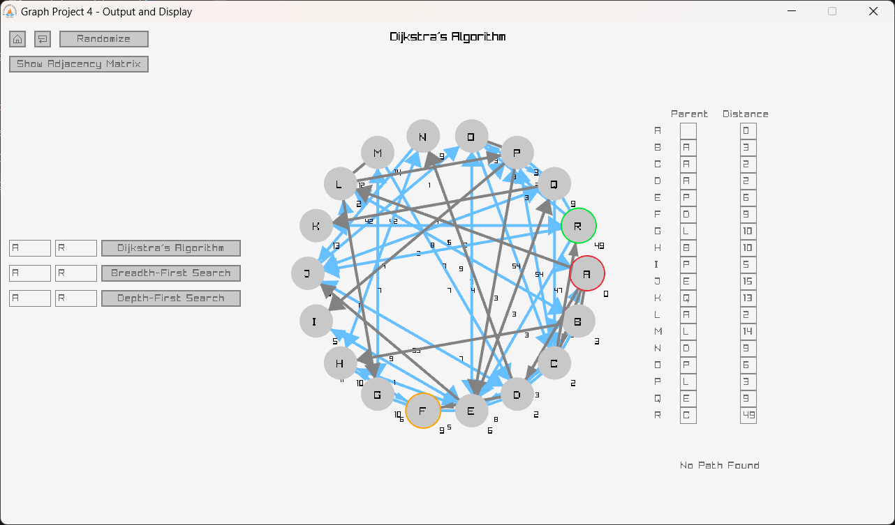

# Graph Visualization Project

A Graph Visualization Application that is made as the Project of Group 4 in CS1105 2022-26 at IET, JKLU.

The applications features Visualizations of Graph Algorithms- Dijkstra's Algorithm, Breadth-First Search and Depth-First Search. It uses Colours and Arrows to signify the current state and actions of the Algorithm, along with the appropriate Data Structure used.

### Building

1. Download and Install MinGW and GCC.
2. Download the releases of [raylib](https://github.com/raysan5/raylib) and [raygui](https://github.com/raysan5/raygui). Unzip the `include` and `lib` folders in the `include` and `lib` folders of MinGW.
3. Clone this Repository using `git clone https://github.com/Swastik2442/graphProject4`.
4. Edit the Makefile(s) to suit your Development Setup.
5. Build the Project using `make`.

> This branch contains Extra Code not required for the Project. The Code submitted as the Project is present in the [modif](https://github.com/Swastik2442/graphProject4/tree/modif) branch.
